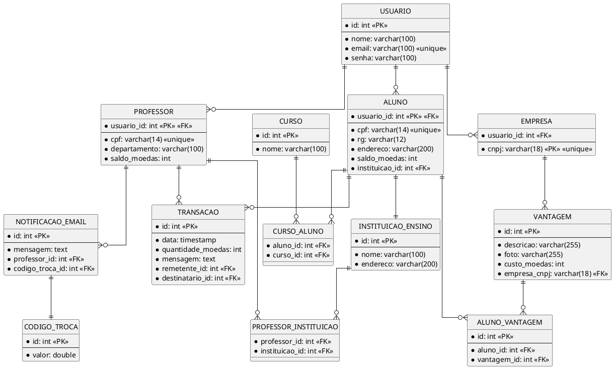

```plantuml
@startuml
skinparam linetype ortho
top to bottom direction
hide circle

' === ENTIDADES DE IDENTIDADE ===
entity USUARIO {
  * id: int <<PK>>
  --
  * nome: varchar(100)
  * email: varchar(100) <<unique>>
  * senha: varchar(100)
}

entity EMPRESA {
  * usuario_id: int <<FK>>
  --
  * cnpj: varchar(18) <<PK>> <<unique>>
}

entity ALUNO {
  * usuario_id: int <<PK>> <<FK>>
  --
  * cpf: varchar(14) <<unique>>
  * rg: varchar(12)
  * endereco: varchar(200)
  * saldo_moedas: int
  * instituicao_id: int <<FK>>
}

entity PROFESSOR {
  * usuario_id: int <<PK>> <<FK>>
  --
  * cpf: varchar(14) <<unique>>
  * departamento: varchar(100)
  * saldo_moedas: int
}

entity INSTITUICAO_ENSINO {
  * id: int <<PK>>
  --
  * nome: varchar(100)
  * endereco: varchar(200)
}

entity PROFESSOR_INSTITUICAO {
  * professor_id: int <<FK>>
  * instituicao_id: int <<FK>>
}

' === CURSO / ALUNO ===
entity CURSO {
  * id: int <<PK>>
  --
  * nome: varchar(100)
}

entity CURSO_ALUNO {
  * aluno_id: int <<FK>>
  * curso_id: int <<FK>>
}

' === VANTAGENS / TROCAS ===
entity VANTAGEM {
  * id: int <<PK>>
  --
  * descricao: varchar(255)
  * foto: varchar(255)
  * custo_moedas: int
  * empresa_cnpj: varchar(18) <<FK>>
}

entity ALUNO_VANTAGEM {
  * id: int <<PK>>
  --
  * aluno_id: int <<FK>>
  * vantagem_id: int <<FK>>
}

' === TRANSACOES / NOTIFICACOES ===
entity TRANSACAO {
  * id: int <<PK>>
  --
  * data: timestamp
  * quantidade_moedas: int
  * mensagem: text
  * remetente_id: int <<FK>>
  * destinatario_id: int <<FK>>
}

entity NOTIFICACAO_EMAIL {
  * id: int <<PK>>
  --
  * mensagem: text
  * professor_id: int <<FK>>
  * codigo_troca_id: int <<FK>>
}

entity CODIGO_TROCA {
  * id: int <<PK>>
  --
  * valor: double
}

' === RELACIONAMENTOS ===

USUARIO ||--o{ ALUNO
USUARIO ||--o{ PROFESSOR
USUARIO ||--o{ EMPRESA

ALUNO ||--o{ CURSO_ALUNO
CURSO ||--o{ CURSO_ALUNO

ALUNO ||--o{ ALUNO_VANTAGEM
VANTAGEM ||--o{ ALUNO_VANTAGEM
EMPRESA ||--o{ VANTAGEM

ALUNO ||--o{ TRANSACAO
PROFESSOR ||--o{ TRANSACAO

PROFESSOR ||--o{ PROFESSOR_INSTITUICAO
INSTITUICAO_ENSINO ||--o{ PROFESSOR_INSTITUICAO

ALUNO ||--|| INSTITUICAO_ENSINO

PROFESSOR ||--o{ NOTIFICACAO_EMAIL
NOTIFICACAO_EMAIL ||--|| CODIGO_TROCA
@enduml
```
